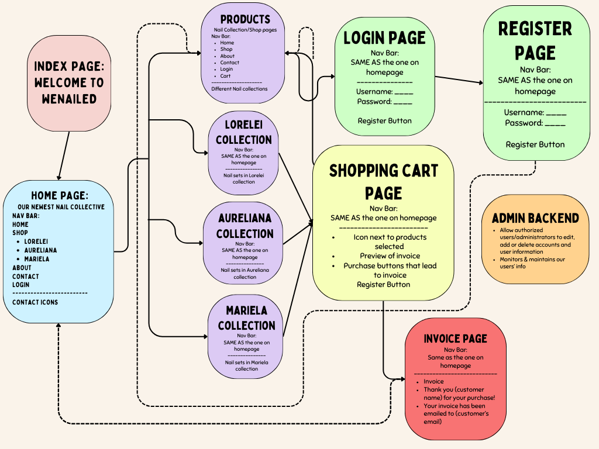

## Show what each page will look like. 

The pages don't need to be fully functional, but the design should be clear. Here's an example PPT prototype:

Click HERE [link](https://dport96.github.io/ITM352/morea/150.Assignment2/experience-Assignment2_retrospective.html) for an overview of our prototype layout and functionality for our Assignment 3 e-commerce website.

## 1. Describe your design for your site’s shopping cart.

Our design includes a dedicated shopping cart page. Users can easily manage the quantities of their selected products here. This page is similar to the invoice page, providing a preview of items and quantities before final confirmation. The cart uses session-based data storage, keeping track of the user's choices. Users can modify product quantities in the cart, either increasing or removing them. Once ready, they can proceed to purchase by clicking the "Complete Purchase" button. This takes them to the Invoice page. However, users need to be logged in or register an account to access the invoice page. If not logged in, they're redirected to the login page.

## 2. Explain how you will use sessions to manage your shopping cart.

We're using session management for our shopping cart data, focusing on the quantities of products users input. Each product type is a key, with quantities stored as an array. For instance, if a user picks products from different pages, the cart might look like this: `{Gellie: [1, 2, 3], Nerissa: [4, 5, 6]}`. This method keeps product selections organized and accessible.

## 3. Discuss the security measures for your application.

To prevent unauthorized access, we're implementing an authentication system using cookies. This is crucial during shopping. The server will verify a user's logged-in status via a valid cookie before directing them to the invoice page. If there's no cookie, indicating the user isn't logged in, they're sent to the login page to sign in or register. Aware of potential cookie vulnerabilities, we're adding security layers like secure and HttpOnly flags, and considering encryption and regular validation checks for enhanced security.

## 4. Addressing security for unauthenticated access.

Our main security focus is preventing unregistered users from accessing personal data. We're using cookies for session management, requiring users to log in or register before making purchases. Recognizing the limitations of client-side cookies, we're also implementing a session timeout feature. This automatically logs out inactive users, further securing user data.

## 5. How do you personalize the UI upon successful login?

Assignment 2's complexity, especially in login and registration processes, included handling data in the user JSON file. The code managed existing data and updated it with new registration info. Despite being extensive, it improved my understanding of data handling.

## 6. How is work divided among partners?

Teamwork is key in our approach. We're tackling tasks together, one at a time, to stay in sync. This helps us understand each other's work and integrate our code efficiently. We focus collectively on a single task for better outcomes. Keeping each other informed about individual discoveries ensures seamless collaboration and progress.

## 7. How is Assignment 3 different from Assignment 2?

Assignment 3 brings its own challenges, perhaps more complex than Assignment 2. I'm contemplating starting from scratch. It emphasizes user experience in coding, requiring easy navigation and secure data handling. This involves significant UI changes and validations, and tracking the user's journey across the website. A detailed outline is crucial for planning the user navigation, ensuring a smooth and intuitive experience.
