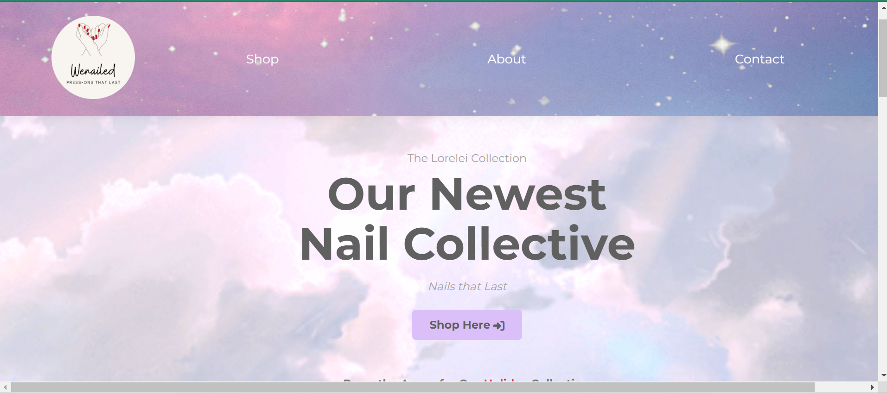

## My programming skills have greatly improved in the following ways:

My proficiency in programming has seen significant enhancements, particularly in my grasp of if statements and CSS. I've developed a deeper understanding of coding concepts, enabling me to troubleshoot effectively when faced with challenges. Assignments, such as Assignment 1, have sharpened my systematic problem-solving skills, transforming my approach to complex tasks. Initially, I grappled with intricate problems, but consistent practice and utilizing resources like ChatGPT have empowered me to break down tasks methodically and craft efficient solutions.

## I need to work on the following to improve my programming skills:

While I've made strides in certain aspects, I recognize the need to deepen my understanding of specific functions, especially those I struggle with executing. Reading the manual and familiarizing myself with basic JavaScript functions is an area for improvement. Strengthening my logical thinking is also crucial, as I sometimes find myself getting confused when contemplating solutions, emphasizing the importance of a more forward-minded approach.

## I have learned a lot from doing WODs and can do them without copying the screencast:

WODs have proven to be a pivotal learning tool, challenging me to execute tasks independently while articulating my understanding. The absence of a screencast during later WODs pushed me to troubleshoot and think critically, building my confidence through perseverance and collaboration with classmates.

## The labs have helped me learn, and I can complete them with confidence:

While I find some labs challenging, I acknowledge their role in my learning journey. Careful review of screencasts and lecture readings is essential for independent completion. Patience remains crucial as I navigate certain challenging aspects of the labs, recognizing that seeking assistance is a valuable part of the learning process.

## I learned a lot from my experience doing Assignment 1 and feel ready to work on Assignment 2:

Assignment 1 was a valuable learning experience, providing insights that will undoubtedly aid me in Assignment 2. Although a certain level of nervousness persists, I am committed to seeking guidance from Dan when needed. Recognizing that his assistance is readily available, I am determined not to let intimidation hinder my progress.

## I think the class can be improved to help my learning in the following ways:

I suggest incorporating more labs or WODs that directly relate to crucial assignments, particularly Assignment 2. A slightly faster pace during class activities, especially labs, would help maintain engagement. While acknowledging the importance of thorough explanations from Professor Port, a balance that minimizes downtime could enhance overall effectiveness. Additionally, extending the time allocated for assignments, like Assignment 2, would allow for more comprehensive work and attention to detail.

## What helps me the most in class are (WODs, Labs, class website, screencasts, readings, quizzes, one on one help, working with classmates, etc.):

The WODs have been instrumental in my understanding, providing a conceptual framework that repetition solidifies. One-on-one assistance from Professor Port offers valuable insights, delving deeper into concepts not covered in class. Collaborative problem-solving with classmates is beneficial, allowing shared troubleshooting experiences. The smaller class size fosters strong relationships with classmates, creating a supportive learning environment.

